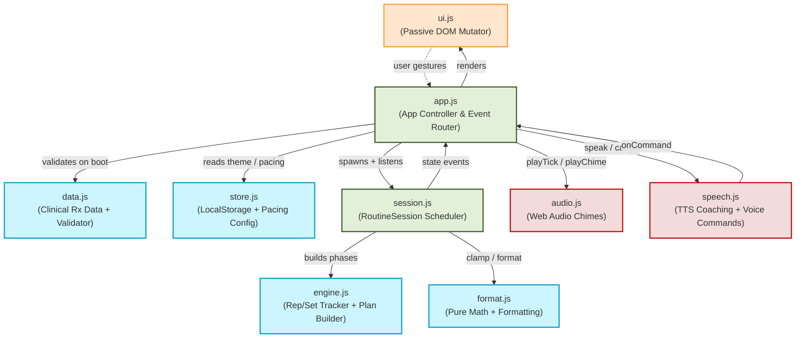
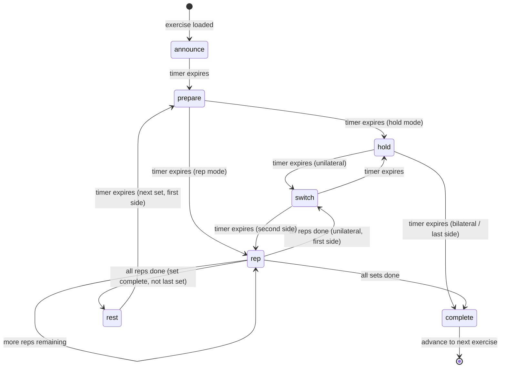

# Neck PT Companion — Architecture Guide

A dependency-free, PWA-native physical therapy companion app. No build step, no framework. Runs directly from the browser via ES modules.

## Module Map

```
index.html          — Static screen skeleton (DOM template) + <script type="module">
sw.js               — Service Worker: cache-first offline PWA with exercise pre-caching
manifest.json       — PWA manifest (icons, theme color, display mode)
styles.css          — Full design system: tokens, glassmorphism cards, animations
test.mjs            — Node unit tests for all DOM-free modules (41 tests)

src/
  data.js           — PROGRAM: single source of truth (patient/provider meta + 11 exercises)
                      + validateProgram() startup schema guard
  format.js         — Pure formatting & chart-geometry helpers (no DOM)          ← tested
  store.js          — localStorage persistence, history, day-streak, custom pacing← tested
  engine.js         — CountdownTimer, RepSetTracker, buildExercisePlan (no DOM)  ← tested
  session.js        — RoutineSession: DOM-free autopilot scheduler state machine  ← tested
  audio.js          — Web Audio API cue synthesizer (tick/warning/chime)
  speech.js         — Speaker (TTS coaching) + VoiceCommander (recognition)      ← tested
  ui.js             — View: owns DOM cache and every DOM mutation (passive)
  app.js            — Controller: thin event router, wires session ↔ view ↔ audio

exercises/
  NN-<slug>/
    <slug>.jpeg                    — Source photo (MedBridge GO printout)
    example-1.png, example-2.png…  — Cropped demonstration panels
    vector-1.png, vector-2.png…    — Generated vector illustrations (animation frames)

tools/
  gen_neck_images.py  — Python script: generates vector-*.png exercise illustrations
  image-prompts.md    — AI image generation prompts for each exercise
```

---

## Architecture: One-Way Data Flow

The codebase enforces a strict **Model → Controller → View** flow. The View is completely passive — it never reads state or calls back into logic.



---

## Module Responsibilities

| Module | Responsibility | DOM? | Testable in Node? |
|---|---|---|---|
| `data.js` | PROGRAM data + `validateProgram()` | No | Yes |
| `format.js` | Number formatting, chart geometry, greeting | No | Yes |
| `store.js` | localStorage CRUD, streak math, pacing config | No | Yes |
| `engine.js` | `buildExercisePlan()`, `RepSetTracker`, `CountdownTimer` | No | Yes |
| `session.js` | `RoutineSession` — setInterval scheduler, phase walking, tempo | No | Yes |
| `audio.js` | Synthesized cues via Web Audio API | Browser | No |
| `speech.js` | `Speaker` (TTS), `VoiceCommander` (recognition) | Browser | Partial |
| `ui.js` | All DOM mutations, screen routing, SVG charts | Browser | No |
| `app.js` | Event wiring, session lifecycle, routing | Browser | No |

---

## Guided Autopilot: Phase State Machine

When a routine starts, `app.js` instantiates a `RoutineSession` which builds an ordered list of coaching phases via `buildExercisePlan()` in `engine.js`. A 1-second `setInterval` walks the phases automatically.



Each phase carries:
- `type` — phase category (see above diagram)
- `durationSec` — wall-clock duration (coaching phases are tempo-scaled; `hold` is never scaled)
- `say` — TTS cue spoken at phase entry
- `countdown` — whether the ring timer is shown
- `breathing` — whether the inhale/exhale guide is active
- `side` — `'left' | 'right' | null`

---

## Voice Command Grammar

The `GRAMMAR` array in `speech.js` is evaluated in priority order — multi-word phrases win over bare keywords:

| Spoken phrase | Command |
|---|---|
| "slow down", "slower", "too fast" | `slower` |
| "speed up", "faster", "too slow" | `faster` |
| "repeat", "again", "restart", "redo" | `repeat` |
| "go back", "previous", "back" | `back` |
| "next", "skip", "forward", "move on" | `next` |
| "resume", "continue", "go", "play" | `resume` |
| "pause", "stop", "wait", "freeze" | `pause` |

All commands are also available as:
- **On-screen buttons** — transport bar below the illustration
- **Keyboard shortcuts** — Space (pause), ←/→ (back/skip), R (repeat), -/+ (tempo), M (mute), Esc (exit)
- **Tap on the countdown ring** — pause/resume

---

## Pacing Configuration

Base coaching durations live in `src/store.js` as `DEFAULT_PACING` and are persisted per-user in localStorage under the key `neck_pt_pacing_config`. The runtime Slower/Faster buttons apply a `tempoScale` multiplier (range: 0.5× to 2.0×) on top of the stored base pacing.

> **Important**: `hold_seconds` from the clinical dosage is **never** affected by tempo scaling — the prescribed hold duration is always delivered exactly as prescribed.

```js
DEFAULT_PACING = {
  announceSec: 3,   // "Seated Upper Trapezius Stretch. Starting on the left."
  prepareSec:  5,   // "Get into position."
  switchSec:   6,   // "Switch to the right side."
  restSec:    12,   // "Set 2 of 3. Rest and breathe."
  repSec:      4,   // one dynamic rep (move + return)
  isoRepSec:   5,   // one isometric rep (engage + 3–4" hold + release)
  completeSec: 2,   // "Exercise complete. Well done."
}
```

---

## Exercise Data Shape (`src/data.js`)

```jsonc
{
  "order": 1,
  "slug": "seated-upper-trapezius-stretch",
  "title": "Seated Upper Trapezius Stretch",
  "category": "stretch | isometric | mobilization | nerve-glide | strengthening",
  "folder": "exercises/01-seated-upper-trapezius-stretch",
  "source_image": "seated-upper-trapezius-stretch.jpeg",
  "unilateral": true,               // drives left/right side switching
  "dosage": {
    "hold_seconds": 30 | null,      // present → timer hold mode; null → reps mode
    "reps": null | { "min": 5, "max": 5 },
    "sets": null | { "min": 2, "max": 3 },
    "daily": 1 | null,
    "weekly": 7 | null
  },
  "equipment": ["foam roller"],     // optional
  "example_image_count": 2,         // # of example-/vector- frames in the folder
  "setup": "...",
  "movement": "...",
  "tip": "..." | null,
  "notes": ["3-4\" holds"]          // optional handwritten clinician annotations
}
```

**Range display rule**: show `"5"` when `min === max`, otherwise `"min–max"` (e.g. `"6–8"`).

---

## PWA & Offline Strategy (`sw.js`)

The service worker uses **cache-first with network fallback**:

1. **Install** — pre-caches the entire app shell (`src/*.js`, `styles.css`, `index.html`) and the first illustration frame (`vector-1.png`) for all 11 exercises. The install fails if any shell asset is missing; exercise images are best-effort.
2. **Activate** — deletes all older caches by version name.
3. **Fetch** — serves from cache first; on miss, fetches from network and stores the response for next time. Cross-origin requests (e.g. Google Fonts) are passed through without caching.

The result: after the first page load the app works 100% offline — including all vector illustrations — without requiring any extra user action.

---

## LocalStorage Keys

All keys are namespaced under `neck_pt_`:

| Key | Type | Purpose |
|---|---|---|
| `neck_pt_history` | JSON array | Last 30 session logs |
| `neck_pt_streak` | integer string | Current consecutive-day streak |
| `neck_pt_last_date` | date string | `toDateString()` of last session |
| `neck_pt_theme` | `'light' \| 'dark'` | User theme preference |
| `neck_pt_speech_muted` | `'0' \| '1'` | TTS coaching mute state |
| `neck_pt_exit_confirm_dismissed` | `'0' \| '1'` | Skip exit confirmation sheet |
| `neck_pt_completed_today_slugs` | JSON array of strings | Slugs completed today |
| `neck_pt_completed_today_date` | date string | Date the slug list applies to |
| `neck_pt_pacing_config` | JSON object | Custom coaching pacing override |

`store.js` validates the structural type of each JSON value on load and silently resets corrupted entries to their typed default — the app never crashes due to stale or malformed localStorage data.

---

## Running Locally

ES modules require an HTTP origin (won't load from `file://`):

```bash
npm start    # serves on http://localhost:8080 via http-server
npm test     # runs 41 Node unit tests (no browser needed)
```
